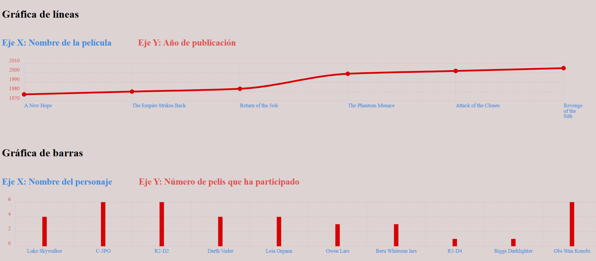

# 📊 Gráficas Star Wars

Visualización de datos de la API de Star Wars ([SWAPI](https://swapi.info)) usando **Chartist.js**.

## 🚀 ¿Qué hace?

- **Gráfica de líneas** — muestra las películas de Star Wars en el eje X y su año de publicación en el eje Y.
- **Gráfica de barras** — muestra los 10 primeros personajes en el eje X y el número de películas en las que aparecen en el eje Y.

## 🛠️ Tecnologías

- HTML, CSS, JavaScript (async/await)
- [Chartist.js](https://chartist.dev/) — librería de gráficas
- [SWAPI](https://swapi.info) — API pública de Star Wars

## 📁 Estructura
```
graficas-starwars/
├── index.html
├── style.css
└── script.js
└── README.md
```

## ▶️ Cómo ejecutarlo

1. Clona el repositorio
```bash
   git clone https://github.com/TU_USUARIO/graficas-starwars.git
```
2. Abre `index.html` en el navegador — sin servidor necesario.

## 📡 API utilizada

- `GET https://swapi.info/api/films` → películas
- `GET https://swapi.info/api/people` → personajes

---